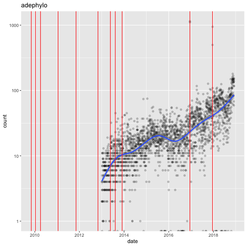

<!-- README.md is generated from README.Rmd. Please edit that file -->

# summarizetaskview

Way to quickly summarize info from a task view (or other list of packages)

This was inspired by [Jonathan Chang's post](https://jonathanchang.org/blog/what-r-package-for-phylogenetics-is-the-most-popular/) about downloads for different phylogenetics-related R packages as well as my long term curiosity about how packages in our area. It was also (I now realize after [Maëlle Salmon's](https://twitter.com/ma_salmon) tweet about this, inspired by this [rOpenSci hackathon project, packagemetrics](https://github.com/ropenscilabs/packagemetrics)). It depends on [goodpractice](https://cran.r-project.org/web/packages/goodpractice/vignettes/goodpractice.html) (thanks to [Auriel Fournier](https://twitter.com/RallidaeRule) for pointing to that package) and also uses the packages crandb, cranlogs, ggplot2, lubridate, ctv, packagemetrics, and parallel.

|package  |last_update |years_since_last_update |years_since_first_release |number_of_CRAN_releases |has_coverage |has_url |has_bug_reporting |downloads_last_year |has_vignette_build |percent_maximum_ideal_complexity |days_since_last_issue_closed |days_since_last_commit |
|:--------|:-----------|:-----------------------|:-------------------------|:-----------------------|:------------|:-------|:-----------------|:-------------------|:------------------|:--------------------------------|:----------------------------|:----------------------|
|adephylo |2017-12-18  |0.97                    |9.09                      |11                      |FALSE        |FALSE   |FALSE             |24082               |FALSE              |330                              |NA                           |NA                     |
|adhoc    |2017-03-17  |1.73                    |4.99                      |2                       |TRUE         |TRUE    |FALSE             |4772                |FALSE              |390                              |NA                           |NA                     |

