<!-- README.md is generated from README.Rmd. Please edit that file -->

# summarizetaskview

Way to quickly summarize info from a task view (or other list of
packages)

This was inspired by [Jonathan Chang’s
post](https://jonathanchang.org/blog/what-r-package-for-phylogenetics-is-the-most-popular/)
about downloads for different phylogenetics-related R packages as well
as my long term curiosity about how packages in our area. It was also (I
now realize after [Maëlle Salmon’s](https://twitter.com/ma_salmon) tweet
about this, inspired by this [rOpenSci hackathon project,
packagemetrics](https://github.com/ropenscilabs/packagemetrics)). It
depends on
[goodpractice](https://cran.r-project.org/web/packages/goodpractice/vignettes/goodpractice.html)
(thanks to [Auriel Fournier](https://twitter.com/RallidaeRule) for
pointing to that package) and also uses the packages crandb, cranlogs,
ggplot2, lubridate, ctv, packagemetrics, and
parallel.

| package       | last\_update | years\_since\_last\_update | years\_since\_first\_release | number\_of\_CRAN\_releases | has\_coverage | has\_url | has\_bug\_reporting | downloads\_last\_year | has\_vignette\_build | percent\_maximum\_ideal\_complexity | days\_since\_last\_issue\_closed | days\_since\_last\_commit |
| :------------ | :----------- | :------------------------- | :--------------------------- | :------------------------- | :------------ | :------- | :------------------ | :-------------------- | :------------------- | :---------------------------------- | :------------------------------- | :------------------------ |
| adephylo      | 2017-12-18   | 0.98                       | 9.1                          | 11                         | FALSE         | FALSE    | FALSE               | 24013                 | FALSE                | 330                                 | NA                               | NA                        |
| adhoc         | 2017-03-17   | 1.73                       | 4.99                         | 2                          | TRUE          | TRUE     | FALSE               | 4756                  | FALSE                | 390                                 | NA                               | NA                        |
| adiv          | 2018-08-24   | 0.29                       | 1.39                         | 3                          | TRUE          | FALSE    | FALSE               | 3966                  | FALSE                | 710                                 | NA                               | NA                        |
| ape           | 2018-09-24   | 0.21                       | 16.3                         | 93                         | FALSE         | TRUE     | FALSE               | 449285                | FALSE                | 1420                                | NA                               | NA                        |
| apex          | 2017-09-23   | 1.21                       | 3.65                         | 4                          | FALSE         | TRUE     | TRUE                | 5754                  | TRUE                 | 80                                  | 445                              | NA                        |
| aphid         | 2018-11-10   | 0.08                       | 1.46                         | 6                          | FALSE         | TRUE     | TRUE                | 6820                  | TRUE                 | NA                                  | NA                               | NA                        |
| apTreeshape   | 2018-04-04   | 0.68                       | 13.27                        | 13                         | TRUE          | FALSE    | FALSE               | 8642                  | FALSE                | 550                                 | NA                               | NA                        |
| BAMMtools     | 2017-02-03   | 1.85                       | 4.77                         | 12                         | TRUE          | TRUE     | FALSE               | 7997                  | FALSE                | 750                                 | NA                               | NA                        |
| bayou         | 2018-10-09   | 0.17                       | 4.4                          | 5                          | FALSE         | FALSE    | FALSE               | 7318                  | FALSE                | 580                                 | NA                               | NA                        |
| betapart      | 2018-10-18   | 0.14                       | 6.78                         | 8                          | TRUE          | FALSE    | FALSE               | 14784                 | FALSE                | 490                                 | NA                               | NA                        |
| BioGeoBEARS   | 2014-01-02   | 4.94                       | 5.46                         | 3                          | TRUE          | TRUE     | FALSE               | 8616                  | FALSE                | 1570                                | NA                               | NA                        |
| BoSSA         | 2018-11-06   | 0.09                       | 9                            | 14                         | FALSE         | FALSE    | FALSE               | 13050                 | TRUE                 | NA                                  | NA                               | NA                        |
| brms          | 2018-10-23   | 0.13                       | 3.59                         | 37                         | FALSE         | TRUE     | TRUE                | 105444                | TRUE                 | NA                                  | 2                                | 1                         |
| brranching    | 2018-12-05   | 0.01                       | 3.08                         | 4                          | FALSE         | TRUE     | TRUE                | 5478                  | TRUE                 | 110                                 | 10                               | NA                        |
| caper         | 2018-04-17   | 0.65                       | 7.52                         | 6                          | FALSE         | FALSE    | FALSE               | 14353                 | FALSE                | 800                                 | NA                               | NA                        |
| cati          | 2018-05-09   | 0.59                       | 4.46                         | 5                          | TRUE          | TRUE     | FALSE               | 5922                  | FALSE                | 1110                                | 912                              | NA                        |
| convevol      | 2018-11-04   | 0.1                        | 5.29                         | 6                          | TRUE          | FALSE    | FALSE               | 6601                  | FALSE                | 200                                 | NA                               | NA                        |
| corHMM        | 2017-07-19   | 1.39                       | 5.58                         | 12                         | TRUE          | FALSE    | FALSE               | 6055                  | FALSE                | 2040                                | NA                               | NA                        |
| DAMOCLES      | 2015-03-05   | 3.77                       | 4.12                         | 2                          | TRUE          | FALSE    | FALSE               | 4054                  | FALSE                | 450                                 | NA                               | NA                        |
| DDD           | 2018-04-24   | 0.63                       | 6.86                         | 29                         | FALSE         | FALSE    | FALSE               | 9788                  | FALSE                | 840                                 | NA                               | NA                        |
| dendextend    | 2018-10-19   | 0.14                       | 4.85                         | 20                         | FALSE         | TRUE     | TRUE                | 484506                | TRUE                 | NA                                  | 49                               | 50                        |
| dispRity      | 2018-09-20   | 0.22                       | 0.72                         | 2                          | TRUE          | TRUE     | FALSE               | 3233                  | FALSE                | 920                                 | 132                              | 17                        |
| distory       | 2017-03-21   | 1.72                       | 6                            | 4                          | TRUE          | FALSE    | FALSE               | 4672                  | FALSE                | 300                                 | NA                               | NA                        |
| diversitree   | 2017-04-05   | 1.68                       | 7.99                         | 12                         | FALSE         | TRUE     | FALSE               | 7253                  | FALSE                | 380                                 | NA                               | NA                        |
| ecospat       | 2018-06-27   | 0.45                       | 4.38                         | 7                          | FALSE         | TRUE     | TRUE                | 6491                  | TRUE                 | NA                                  | NA                               | 159                       |
| entropart     | 2018-02-05   | 0.84                       | 5.25                         | 15                         | FALSE         | TRUE     | TRUE                | 4908                  | TRUE                 | NA                                  | NA                               | NA                        |
| enveomics.R   | 2018-11-13   | 0.07                       | 2.91                         | 15                         | FALSE         | TRUE     | FALSE               | 9292                  | FALSE                | 730                                 | NA                               | NA                        |
| evobiR        | 2015-09-06   | 3.26                       | 5.14                         | 2                          | TRUE          | TRUE     | FALSE               | 4275                  | FALSE                | 330                                 | NA                               | NA                        |
| expoTree      | 2013-09-03   | 5.27                       | 5.87                         | 4                          | FALSE         | FALSE    | FALSE               | 3617                  | FALSE                | 120                                 | NA                               | NA                        |
| geiger        | 2015-09-07   | 3.26                       | 11.63                        | 19                         | TRUE          | TRUE     | FALSE               | 27857                 | FALSE                | 500                                 | NA                               | NA                        |
| geomorph      | 2018-07-27   | 0.37                       | 6.12                         | 27                         | TRUE          | FALSE    | FALSE               | 20080                 | FALSE                | 770                                 | NA                               | NA                        |
| ggmuller      | 2018-02-16   | 0.81                       | 1.27                         | 6                          | FALSE         | FALSE    | FALSE               | 4446                  | TRUE                 | 250                                 | NA                               | NA                        |
| ggplot2       | 2018-10-25   | 0.12                       | 11.53                        | 33                         | FALSE         | TRUE     | TRUE                | 6355634               | TRUE                 | 290                                 | 2                                | 2                         |
| GUniFrac      | 2018-02-12   | 0.82                       | 6.62                         | 2                          | TRUE          | FALSE    | FALSE               | 9335                  | FALSE                | 220                                 | NA                               | NA                        |
| hisse         | 2018-11-06   | 0.09                       | 3.8                          | 17                         | FALSE         | FALSE    | FALSE               | 7122                  | TRUE                 | 640                                 | NA                               | NA                        |
| HMPTrees      | 2017-07-05   | 1.43                       | 7.06                         | 5                          | FALSE         | FALSE    | FALSE               | 4091                  | FALSE                | 280                                 | NA                               | NA                        |
| HyPhy         | 2012-07-30   | 6.36                       | 6.36                         | 1                          | TRUE          | FALSE    | FALSE               | 3574                  | FALSE                | 1640                                | NA                               | NA                        |
| idendr0       | 2017-02-22   | 1.79                       | 3.18                         | 4                          | TRUE          | TRUE     | TRUE                | 4195                  | FALSE                | 4010                                | NA                               | 647                       |
| ips           | 2014-11-10   | 4.08                       | 4.08                         | 1                          | TRUE          | FALSE    | FALSE               | 5081                  | FALSE                | 310                                 | NA                               | NA                        |
| iteRates      | 2013-05-03   | 5.61                       | 7.47                         | 4                          | TRUE          | FALSE    | FALSE               | 3511                  | FALSE                | 1280                                | NA                               | NA                        |
| jaatha        | 2016-05-13   | 2.58                       | 5.92                         | 15                         | FALSE         | TRUE     | TRUE                | 4083                  | TRUE                 | NA                                  | 679                              | NA                        |
| kdetrees      | 2014-05-30   | 4.53                       | 5.83                         | 3                          | FALSE         | TRUE     | FALSE               | 3501                  | FALSE                | 140                                 | NA                               | NA                        |
| markophylo    | 2018-01-30   | 0.86                       | 3.43                         | 5                          | FALSE         | FALSE    | FALSE               | 4165                  | TRUE                 | 1730                                | NA                               | NA                        |
| MCMCglmm      | 2018-07-03   | 0.44                       | 9.87                         | 42                         | FALSE         | FALSE    | FALSE               | 47610                 | FALSE                | 3080                                | NA                               | NA                        |
| metacoder     | 2018-11-19   | 0.05                       | 2.28                         | 6                          | FALSE         | TRUE     | TRUE                | 5879                  | TRUE                 | NA                                  | 9                                | 9                         |
| metafor       | 2017-06-22   | 1.47                       | 9.52                         | 24                         | FALSE         | TRUE     | TRUE                | 68026                 | TRUE                 | NA                                  | 0                                | NA                        |
| MPSEM         | 2018-05-16   | 0.57                       | 5.27                         | 9                          | FALSE         | FALSE    | FALSE               | 4599                  | TRUE                 | NA                                  | NA                               | NA                        |
| mvMORPH       | 2018-08-04   | 0.35                       | 5.17                         | 11                         | FALSE         | TRUE     | FALSE               | 7964                  | TRUE                 | 1900                                | 24                               | 89                        |
| nLTT          | 2018-04-18   | 0.64                       | 3.89                         | 8                          | FALSE         | TRUE     | TRUE                | 4218                  | TRUE                 | 420                                 | 236                              | NA                        |
| nodiv         | 2018-11-07   | 0.09                       | 4.07                         | 18                         | TRUE          | TRUE     | FALSE               | 2980                  | FALSE                | 480                                 | 33                               | 33                        |
| ouch          | 2017-07-18   | 1.39                       | 14.13                        | 23                         | TRUE          | TRUE     | FALSE               | 5708                  | FALSE                | 440                                 | NA                               | NA                        |
| outbreaker    | 2017-08-17   | 1.31                       | 5.81                         | 11                         | TRUE          | TRUE     | FALSE               | 3944                  | FALSE                | 740                                 | NA                               | NA                        |
| OutbreakTools | 2017-10-05   | 1.18                       | 4.92                         | 8                          | FALSE         | TRUE     | FALSE               | 4739                  | TRUE                 | NA                                  | NA                               | NA                        |
| OUwie         | 2016-06-18   | 2.48                       | 7.23                         | 30                         | TRUE          | FALSE    | FALSE               | 5407                  | FALSE                | 1590                                | NA                               | NA                        |
| paleotree     | 2018-10-02   | 0.19                       | 6.87                         | 23                         | TRUE          | TRUE     | TRUE                | 11686                 | FALSE                | 1650                                | 1003                             | 39                        |
| paleoTS       | 2015-12-02   | 3.02                       | 12.39                        | 12                         | TRUE          | FALSE    | FALSE               | 4705                  | FALSE                | 240                                 | NA                               | NA                        |
| pastis        | 2013-09-11   | 5.25                       | 5.53                         | 3                          | FALSE         | TRUE     | FALSE               | 3290                  | FALSE                | 420                                 | NA                               | NA                        |
| PBD           | 2017-05-04   | 1.6                        | 4.69                         | 7                          | FALSE         | FALSE    | FALSE               | 3666                  | TRUE                 | 260                                 | NA                               | NA                        |
| PCPS          | 2018-05-24   | 0.55                       | 4.61                         | 7                          | TRUE          | FALSE    | FALSE               | 5170                  | FALSE                | 240                                 | NA                               | NA                        |
| pegas         | 2018-07-09   | 0.42                       | 9.58                         | 23                         | FALSE         | TRUE     | FALSE               | 32332                 | FALSE                | 980                                 | NA                               | NA                        |
| phangorn      | 2018-02-15   | 0.81                       | 10.72                        | 47                         | FALSE         | TRUE     | TRUE                | 77860                 | TRUE                 | 1260                                | 67                               | 3                         |
| phyclust      | 2017-12-02   | 1.02                       | 8.87                         | 22                         | TRUE          | TRUE     | TRUE                | 6330                  | FALSE                | 430                                 | 311                              | 311                       |
| phyext2       | 2015-07-27   | 3.37                       | 3.4                          | 2                          | TRUE          | FALSE    | FALSE               | 3229                  | FALSE                | 500                                 | NA                               | NA                        |
| phylobase     | 2017-04-21   | 1.64                       | 9.11                         | 12                         | FALSE         | TRUE     | TRUE                | 26563                 | TRUE                 | 690                                 | 152                              | NA                        |
| phylocanvas   | 2017-10-30   | 1.11                       | 1.85                         | 2                          | FALSE         | TRUE     | TRUE                | 3382                  | TRUE                 | 20                                  | 632                              | 404                       |
| phyloclim     | 2018-05-25   | 0.54                       | 9.03                         | 7                          | TRUE          | FALSE    | FALSE               | 5586                  | FALSE                | 300                                 | NA                               | NA                        |
| PHYLOGR       | 2018-03-20   | 0.72                       | 18.28                        | 13                         | TRUE          | TRUE     | FALSE               | 4419                  | FALSE                | 260                                 | NA                               | NA                        |
| phylogram     | 2018-06-25   | 0.46                       | 1.49                         | 5                          | FALSE         | TRUE     | TRUE                | 4698                  | TRUE                 | 260                                 | NA                               | 165                       |
| phyloland     | 2014-09-13   | 4.24                       | 4.76                         | 4                          | TRUE          | FALSE    | FALSE               | 3261                  | FALSE                | 1350                                | NA                               | NA                        |
| phylolm       | 2018-05-31   | 0.53                       | 5.92                         | 8                          | TRUE          | TRUE     | FALSE               | 8611                  | FALSE                | 1080                                | NA                               | NA                        |
| phylotools    | 2017-12-10   | 1                          | 8.13                         | 5                          | TRUE          | TRUE     | FALSE               | 6544                  | FALSE                | 140                                 | NA                               | NA                        |
| phyloTop      | 2018-02-21   | 0.8                        | 5.36                         | 7                          | TRUE          | FALSE    | FALSE               | 4376                  | FALSE                | 680                                 | NA                               | NA                        |
| phyreg        | 2018-04-12   | 0.66                       | 4.84                         | 3                          | TRUE          | FALSE    | FALSE               | 2587                  | FALSE                | 1980                                | NA                               | NA                        |
| phytools      | 2018-09-28   | 0.2                        | 7.31                         | 36                         | TRUE          | TRUE     | FALSE               | 46858                 | FALSE                | 970                                 | 61                               | 17                        |
| picante       | 2018-05-14   | 0.57                       | 10.52                        | 25                         | FALSE         | FALSE    | FALSE               | 28831                 | FALSE                | 320                                 | NA                               | NA                        |
| pmc           | 2018-05-17   | 0.56                       | 6.88                         | 8                          | FALSE         | TRUE     | TRUE                | 3970                  | TRUE                 | 70                                  | 2391                             | NA                        |
| ratematrix    | 2018-10-30   | 0.11                       | 0.5                          | 2                          | FALSE         | TRUE     | FALSE               | 1786                  | TRUE                 | NA                                  | 39                               | 39                        |
| rdryad        | 2018-06-18   | 0.48                       | 6.8                          | 5                          | TRUE          | TRUE     | TRUE                | 4726                  | FALSE                | 50                                  | 173                              | 52                        |
| rmetasim      | 2018-02-15   | 0.81                       | 14.35                        | 29                         | FALSE         | FALSE    | FALSE               | 5242                  | TRUE                 | 850                                 | NA                               | NA                        |
| rncl          | 2018-07-27   | 0.37                       | 4.02                         | 6                          | TRUE          | TRUE     | TRUE                | 35357                 | FALSE                | 110                                 | 723                              | NA                        |
| RNeXML        | 2018-11-01   | 0.1                        | 4.4                          | 16                         | FALSE         | TRUE     | TRUE                | 32332                 | TRUE                 | 160                                 | 0                                | 0                         |
| rotl          | 2018-09-29   | 0.19                       | 3.38                         | 7                          | FALSE         | TRUE     | TRUE                | 29411                 | TRUE                 | 330                                 | 81                               | 70                        |
| rphast        | 2018-02-11   | 0.82                       | 8.24                         | 10                         | FALSE         | TRUE     | FALSE               | 6137                  | FALSE                | 780                                 | NA                               | NA                        |
| Rphylip       | 2014-03-26   | 4.71                       | 4.75                         | 2                          | TRUE          | TRUE     | FALSE               | 3642                  | FALSE                | 660                                 | NA                               | NA                        |
| SigTree       | 2017-10-02   | 1.19                       | 5.32                         | 10                         | FALSE         | FALSE    | FALSE               | 3732                  | FALSE                | NA                                  | NA                               | NA                        |
| strap         | 2014-11-05   | 4.1                        | 4.7                          | 5                          | TRUE          | FALSE    | FALSE               | 4404                  | FALSE                | 1050                                | NA                               | NA                        |
| surface       | 2014-02-14   | 4.82                       | 5.93                         | 4                          | FALSE         | TRUE     | FALSE               | 3847                  | FALSE                | 840                                 | NA                               | NA                        |
| SYNCSA        | 2018-03-23   | 0.72                       | 7.55                         | 8                          | TRUE          | FALSE    | FALSE               | 5348                  | FALSE                | 910                                 | NA                               | NA                        |
| taxize        | 2018-07-24   | 0.38                       | 6.02                         | 31                         | FALSE         | TRUE     | TRUE                | 32583                 | TRUE                 | 340                                 | 2                                | 2                         |
| TESS          | 2015-10-28   | 3.12                       | 6.17                         | 6                          | FALSE         | FALSE    | FALSE               | 4150                  | TRUE                 | 1630                                | NA                               | NA                        |
| tidytree      | 2018-11-29   | 0.03                       | 0.99                         | 6                          | FALSE         | TRUE     | TRUE                | 10204                 | TRUE                 | NA                                  | 198                              | NA                        |
| treebase      | 2017-02-06   | 1.84                       | 7.13                         | 10                         | FALSE         | TRUE     | TRUE                | 3823                  | TRUE                 | 130                                 | 21                               | NA                        |
| treedater     | 2018-05-04   | 0.6                        | 0.6                          | 1                          | FALSE         | FALSE    | FALSE               | 1634                  | TRUE                 | 280                                 | NA                               | NA                        |
| TreePar       | 2015-01-02   | 3.94                       | 8.48                         | 14                         | TRUE          | FALSE    | FALSE               | 3908                  | FALSE                | 480                                 | NA                               | NA                        |
| treeplyr      | 2018-06-07   | 0.51                       | 2.77                         | 5                          | FALSE         | TRUE     | TRUE                | 3904                  | FALSE                | 110                                 | 947                              | NA                        |
| TreeSim       | 2017-03-20   | 1.72                       | 8.8                          | 14                         | TRUE          | FALSE    | FALSE               | 5282                  | FALSE                | 1290                                | NA                               | NA                        |
| vegan         | 2018-10-25   | 0.12                       | 17.27                        | 81                         | FALSE         | TRUE     | TRUE                | 459854                | TRUE                 | NA                                  | 4                                | 24                        |
| warbleR       | 2018-10-16   | 0.15                       | 3.38                         | 17                         | FALSE         | TRUE     | TRUE                | 5696                  | TRUE                 | NA                                  | 19                               | 1                         |
| windex        | 2014-10-16   | 4.15                       | 4.15                         | 1                          | TRUE          | FALSE    | FALSE               | 2355                  | FALSE                | 200                                 | NA                               | NA                        |

    #> `geom_smooth()` using method = 'gam' and formula 'y ~ s(x, bs = "cs")'

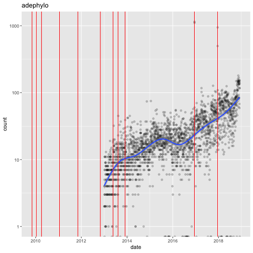

    #> `geom_smooth()` using method = 'gam' and formula 'y ~ s(x, bs = "cs")'

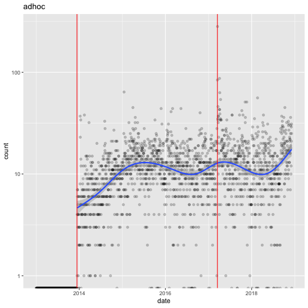

    #> `geom_smooth()` using method = 'loess' and formula 'y ~ x'

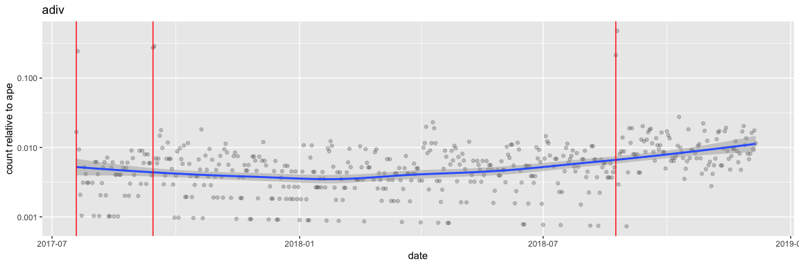

    #> `geom_smooth()` using method = 'gam' and formula 'y ~ s(x, bs = "cs")'

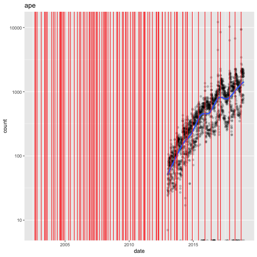

    #> `geom_smooth()` using method = 'gam' and formula 'y ~ s(x, bs = "cs")'

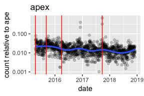

    #> `geom_smooth()` using method = 'loess' and formula 'y ~ x'

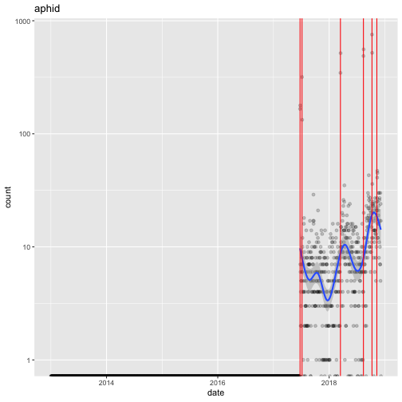

    #> `geom_smooth()` using method = 'gam' and formula 'y ~ s(x, bs = "cs")'

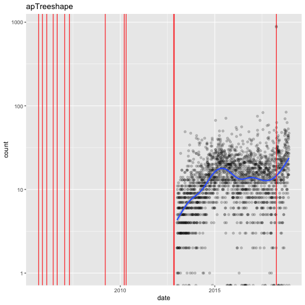

    #> `geom_smooth()` using method = 'gam' and formula 'y ~ s(x, bs = "cs")'

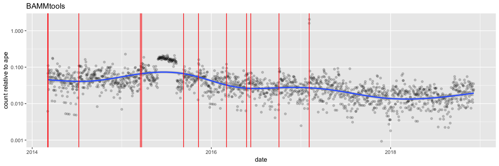

    #> `geom_smooth()` using method = 'gam' and formula 'y ~ s(x, bs = "cs")'

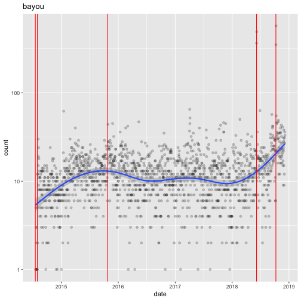

    #> `geom_smooth()` using method = 'gam' and formula 'y ~ s(x, bs = "cs")'

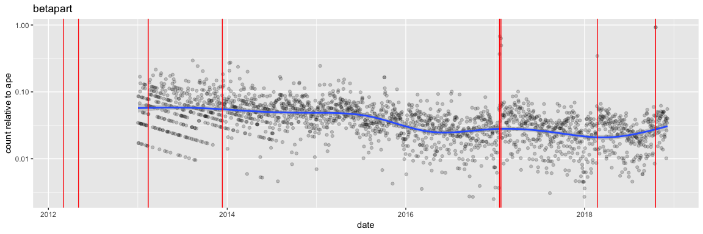

    #> `geom_smooth()` using method = 'gam' and formula 'y ~ s(x, bs = "cs")'

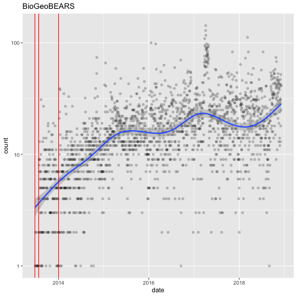

    #> `geom_smooth()` using method = 'gam' and formula 'y ~ s(x, bs = "cs")'

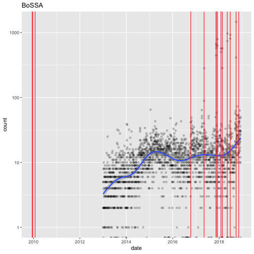

    #> `geom_smooth()` using method = 'gam' and formula 'y ~ s(x, bs = "cs")'

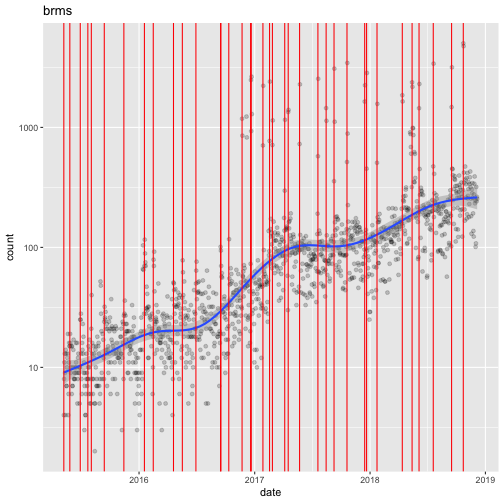

    #> `geom_smooth()` using method = 'gam' and formula 'y ~ s(x, bs = "cs")'

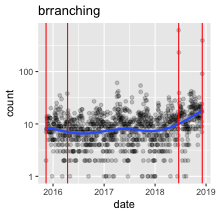

    #> `geom_smooth()` using method = 'gam' and formula 'y ~ s(x, bs = "cs")'

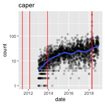

    #> `geom_smooth()` using method = 'gam' and formula 'y ~ s(x, bs = "cs")'

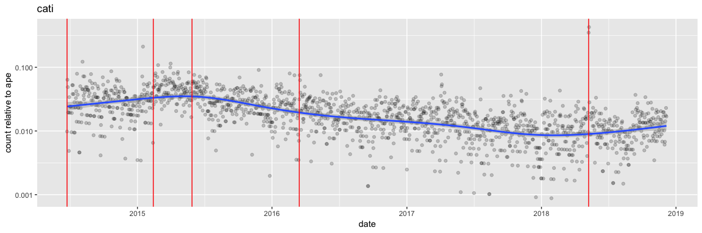

    #> `geom_smooth()` using method = 'gam' and formula 'y ~ s(x, bs = "cs")'

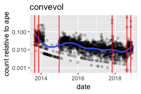

    #> `geom_smooth()` using method = 'gam' and formula 'y ~ s(x, bs = "cs")'

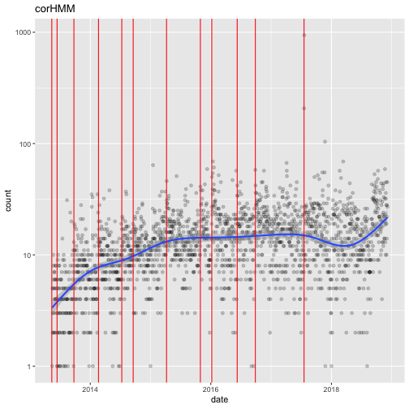

    #> `geom_smooth()` using method = 'gam' and formula 'y ~ s(x, bs = "cs")'

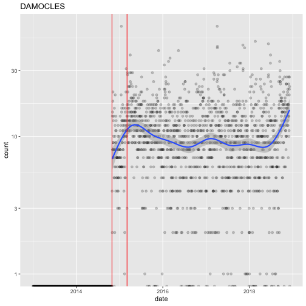

    #> `geom_smooth()` using method = 'gam' and formula 'y ~ s(x, bs = "cs")'

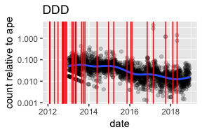

    #> `geom_smooth()` using method = 'gam' and formula 'y ~ s(x, bs = "cs")'

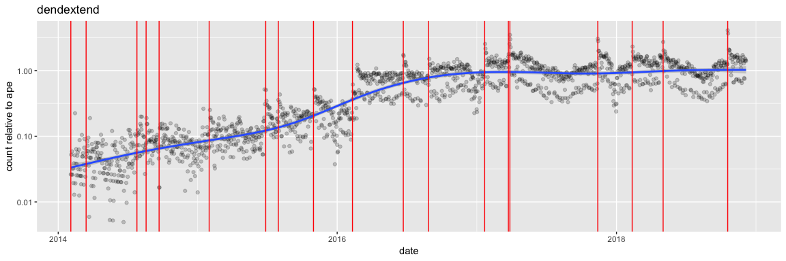

    #> `geom_smooth()` using method = 'loess' and formula 'y ~ x'

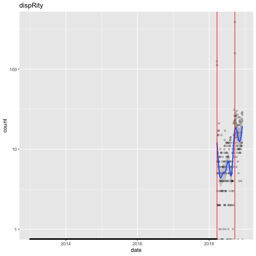

    #> `geom_smooth()` using method = 'gam' and formula 'y ~ s(x, bs = "cs")'

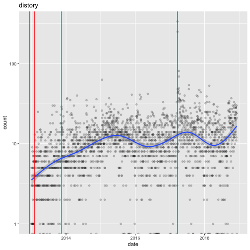

    #> `geom_smooth()` using method = 'gam' and formula 'y ~ s(x, bs = "cs")'

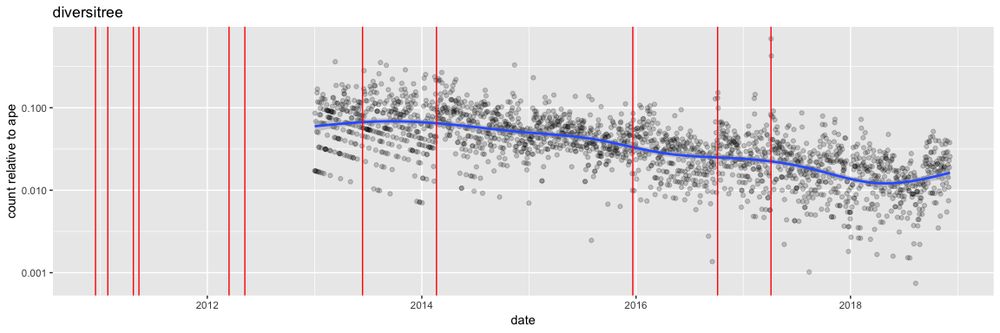

    #> `geom_smooth()` using method = 'gam' and formula 'y ~ s(x, bs = "cs")'

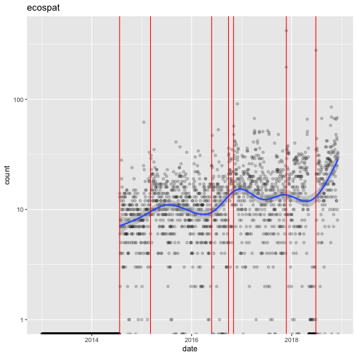

    #> `geom_smooth()` using method = 'gam' and formula 'y ~ s(x, bs = "cs")'

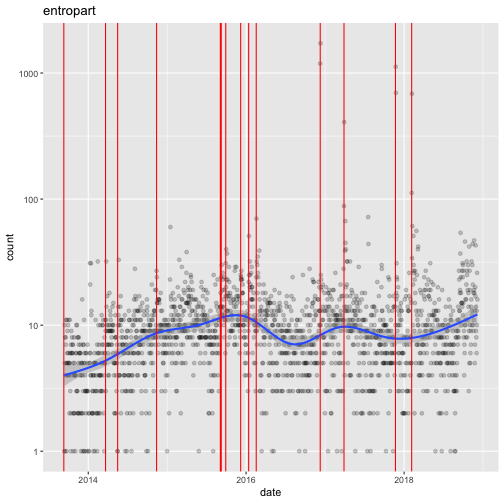

    #> `geom_smooth()` using method = 'gam' and formula 'y ~ s(x, bs = "cs")'

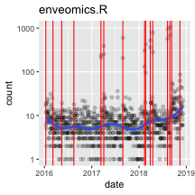

    #> `geom_smooth()` using method = 'gam' and formula 'y ~ s(x, bs = "cs")'

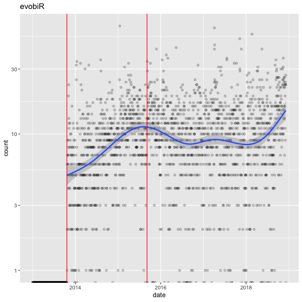

    #> `geom_smooth()` using method = 'gam' and formula 'y ~ s(x, bs = "cs")'

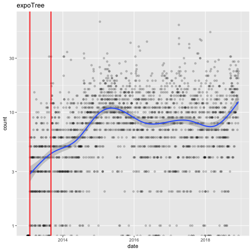

    #> `geom_smooth()` using method = 'gam' and formula 'y ~ s(x, bs = "cs")'

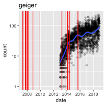

    #> `geom_smooth()` using method = 'gam' and formula 'y ~ s(x, bs = "cs")'

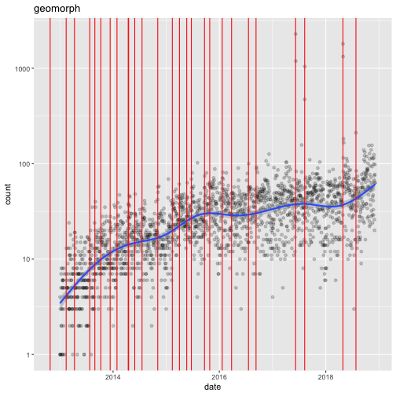

    #> `geom_smooth()` using method = 'loess' and formula 'y ~ x'

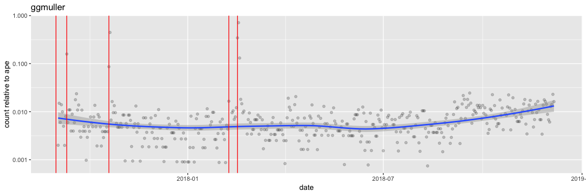

    #> `geom_smooth()` using method = 'gam' and formula 'y ~ s(x, bs = "cs")'

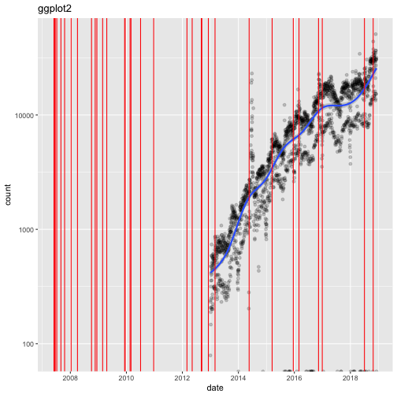

    #> `geom_smooth()` using method = 'gam' and formula 'y ~ s(x, bs = "cs")'

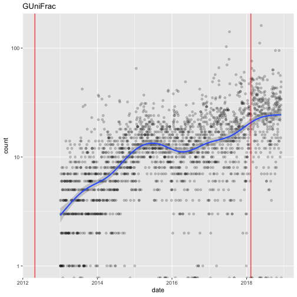

    #> `geom_smooth()` using method = 'gam' and formula 'y ~ s(x, bs = "cs")'

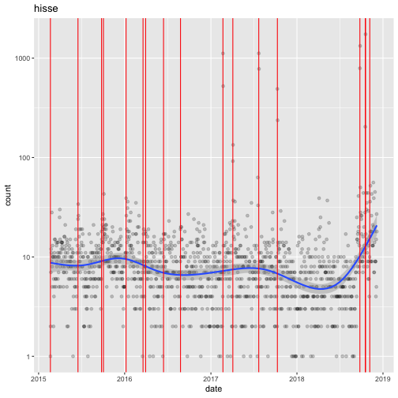

    #> `geom_smooth()` using method = 'gam' and formula 'y ~ s(x, bs = "cs")'

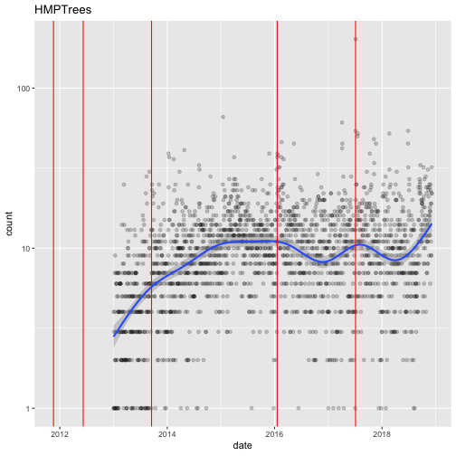

    #> `geom_smooth()` using method = 'gam' and formula 'y ~ s(x, bs = "cs")'

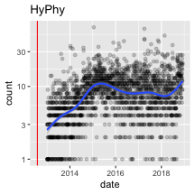

    #> `geom_smooth()` using method = 'gam' and formula 'y ~ s(x, bs = "cs")'

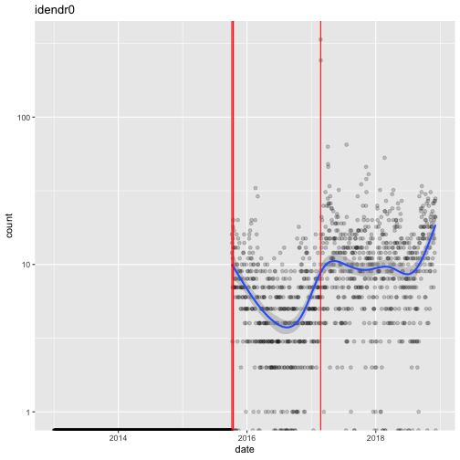

    #> `geom_smooth()` using method = 'gam' and formula 'y ~ s(x, bs = "cs")'

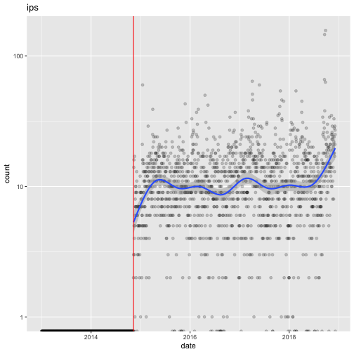

    #> `geom_smooth()` using method = 'gam' and formula 'y ~ s(x, bs = "cs")'

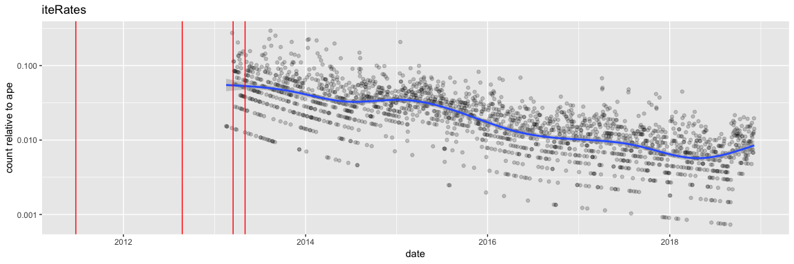

    #> `geom_smooth()` using method = 'gam' and formula 'y ~ s(x, bs = "cs")'

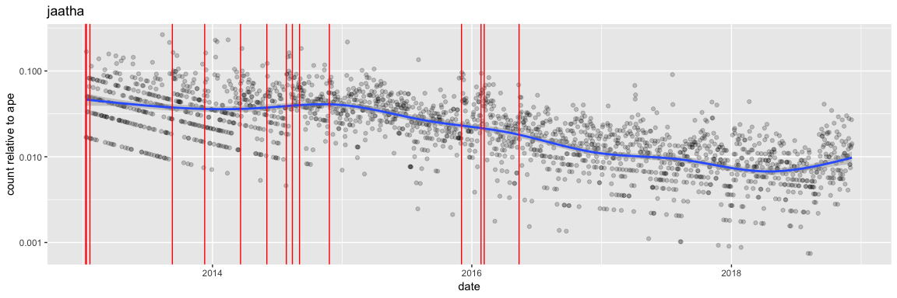

    #> `geom_smooth()` using method = 'gam' and formula 'y ~ s(x, bs = "cs")'

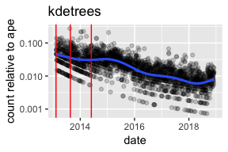

    #> `geom_smooth()` using method = 'gam' and formula 'y ~ s(x, bs = "cs")'

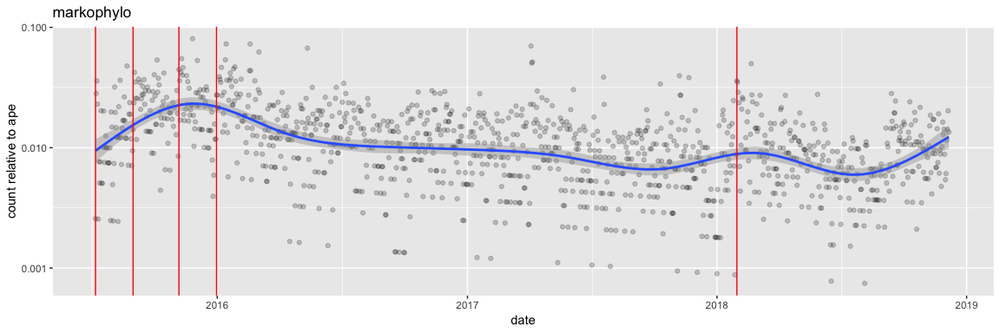

    #> `geom_smooth()` using method = 'gam' and formula 'y ~ s(x, bs = "cs")'

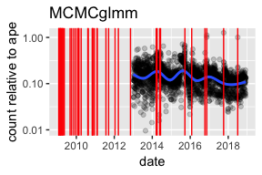

    #> `geom_smooth()` using method = 'loess' and formula 'y ~ x'

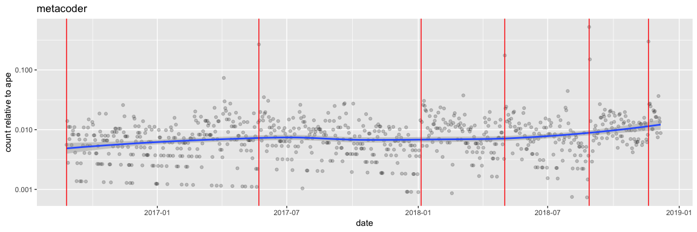

    #> `geom_smooth()` using method = 'gam' and formula 'y ~ s(x, bs = "cs")'

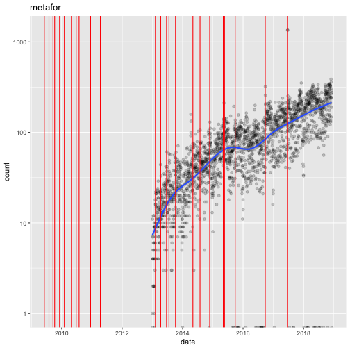

    #> `geom_smooth()` using method = 'gam' and formula 'y ~ s(x, bs = "cs")'

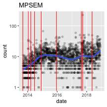

    #> `geom_smooth()` using method = 'gam' and formula 'y ~ s(x, bs = "cs")'

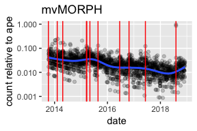

    #> `geom_smooth()` using method = 'gam' and formula 'y ~ s(x, bs = "cs")'

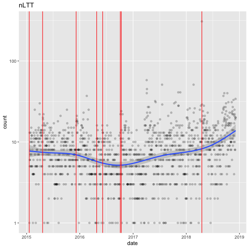

    #> `geom_smooth()` using method = 'gam' and formula 'y ~ s(x, bs = "cs")'

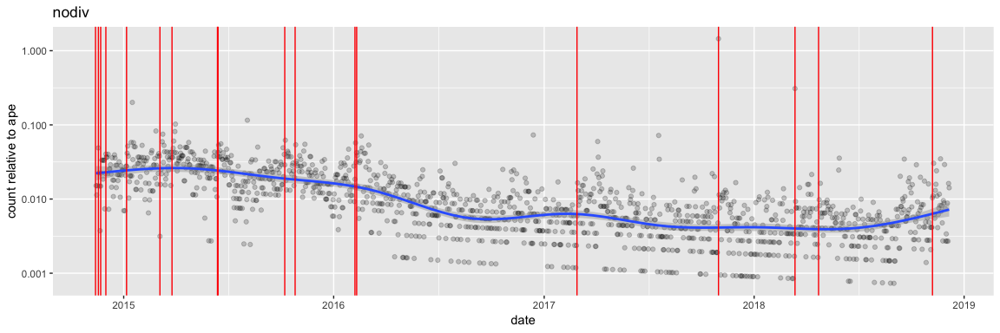

    #> `geom_smooth()` using method = 'gam' and formula 'y ~ s(x, bs = "cs")'

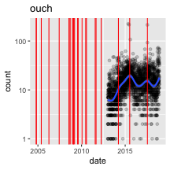

    #> `geom_smooth()` using method = 'gam' and formula 'y ~ s(x, bs = "cs")'

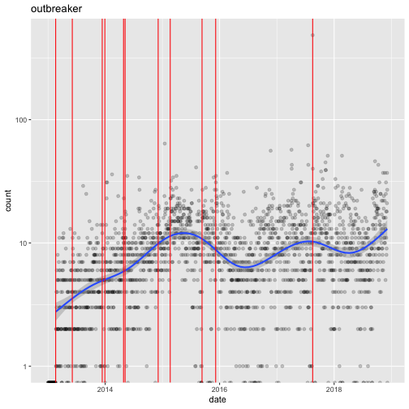

    #> `geom_smooth()` using method = 'gam' and formula 'y ~ s(x, bs = "cs")'

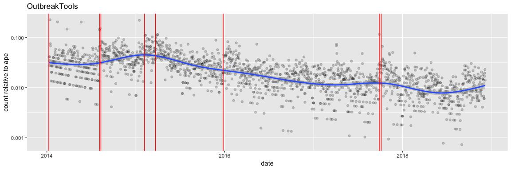

    #> `geom_smooth()` using method = 'gam' and formula 'y ~ s(x, bs = "cs")'

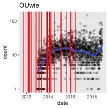

    #> `geom_smooth()` using method = 'gam' and formula 'y ~ s(x, bs = "cs")'

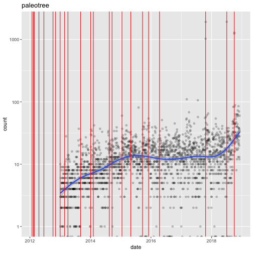

    #> `geom_smooth()` using method = 'gam' and formula 'y ~ s(x, bs = "cs")'

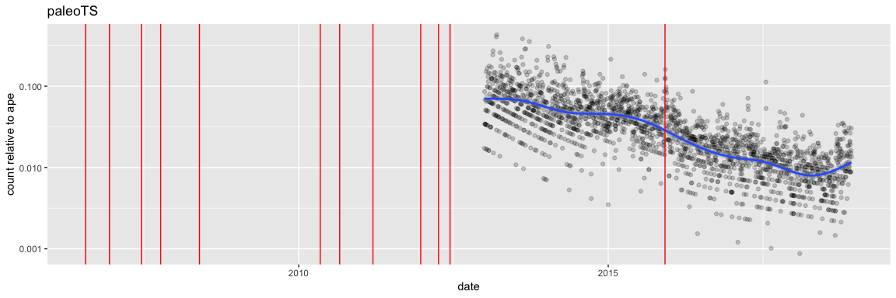

    #> `geom_smooth()` using method = 'gam' and formula 'y ~ s(x, bs = "cs")'

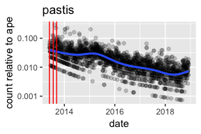

    #> `geom_smooth()` using method = 'gam' and formula 'y ~ s(x, bs = "cs")'

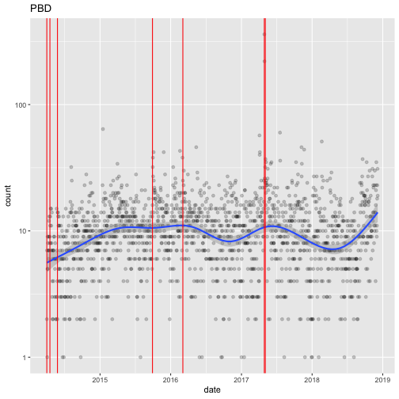

    #> `geom_smooth()` using method = 'gam' and formula 'y ~ s(x, bs = "cs")'

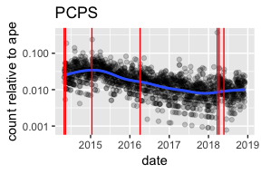

    #> `geom_smooth()` using method = 'gam' and formula 'y ~ s(x, bs = "cs")'

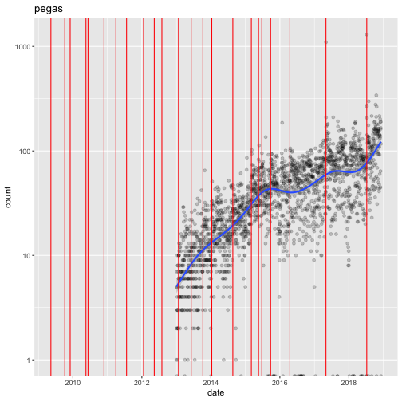

    #> `geom_smooth()` using method = 'gam' and formula 'y ~ s(x, bs = "cs")'

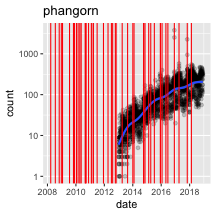

    #> `geom_smooth()` using method = 'gam' and formula 'y ~ s(x, bs = "cs")'

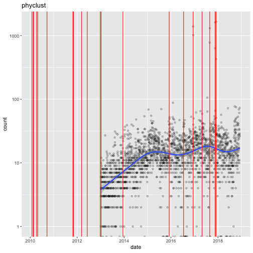

    #> `geom_smooth()` using method = 'gam' and formula 'y ~ s(x, bs = "cs")'

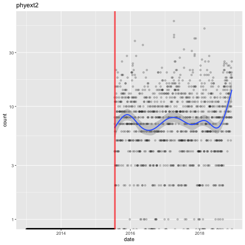

    #> `geom_smooth()` using method = 'gam' and formula 'y ~ s(x, bs = "cs")'

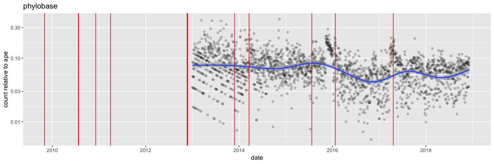

    #> `geom_smooth()` using method = 'loess' and formula 'y ~ x'

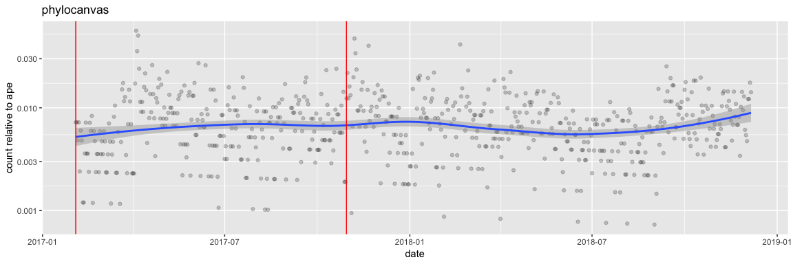

    #> `geom_smooth()` using method = 'gam' and formula 'y ~ s(x, bs = "cs")'

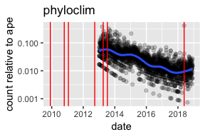

    #> `geom_smooth()` using method = 'gam' and formula 'y ~ s(x, bs = "cs")'

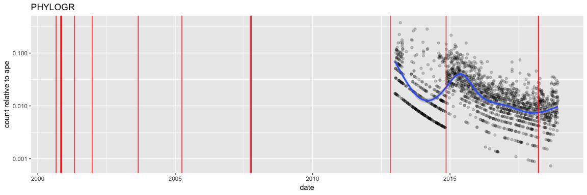

    #> `geom_smooth()` using method = 'loess' and formula 'y ~ x'

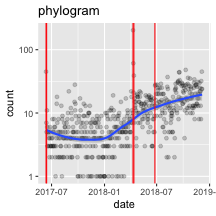

    #> `geom_smooth()` using method = 'gam' and formula 'y ~ s(x, bs = "cs")'

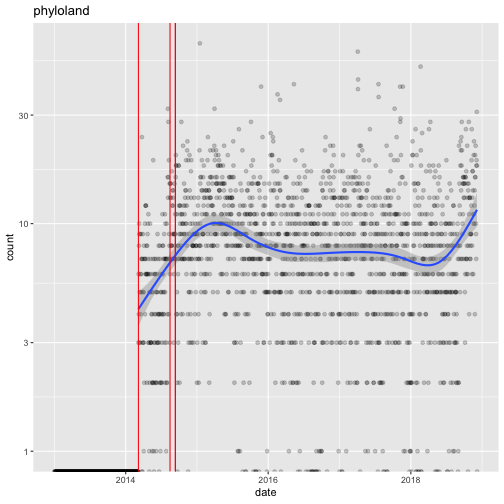

    #> `geom_smooth()` using method = 'gam' and formula 'y ~ s(x, bs = "cs")'

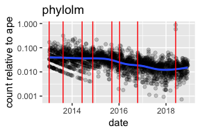

    #> `geom_smooth()` using method = 'gam' and formula 'y ~ s(x, bs = "cs")'

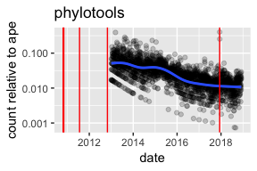

    #> `geom_smooth()` using method = 'gam' and formula 'y ~ s(x, bs = "cs")'

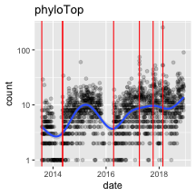

    #> `geom_smooth()` using method = 'gam' and formula 'y ~ s(x, bs = "cs")'

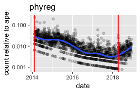

    #> `geom_smooth()` using method = 'gam' and formula 'y ~ s(x, bs = "cs")'

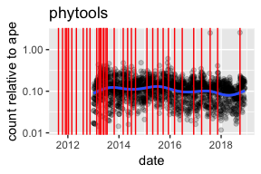

    #> `geom_smooth()` using method = 'gam' and formula 'y ~ s(x, bs = "cs")'

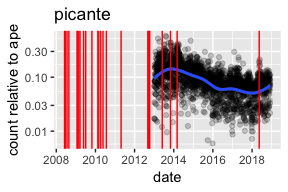

    #> `geom_smooth()` using method = 'gam' and formula 'y ~ s(x, bs = "cs")'

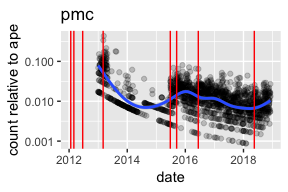

    #> `geom_smooth()` using method = 'loess' and formula 'y ~ x'

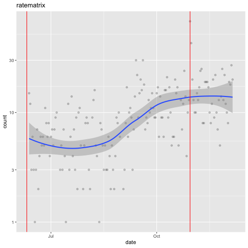

    #> `geom_smooth()` using method = 'gam' and formula 'y ~ s(x, bs = "cs")'

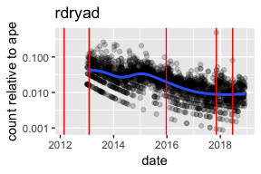

    #> `geom_smooth()` using method = 'gam' and formula 'y ~ s(x, bs = "cs")'

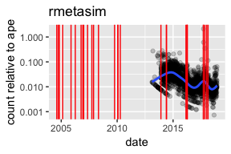

    #> `geom_smooth()` using method = 'gam' and formula 'y ~ s(x, bs = "cs")'

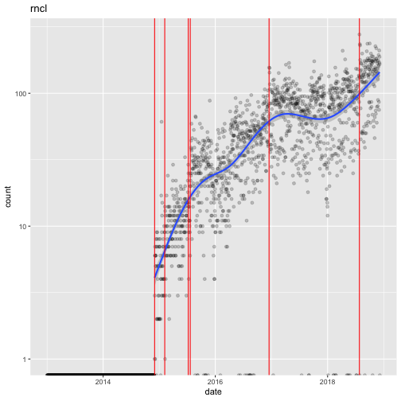

    #> `geom_smooth()` using method = 'gam' and formula 'y ~ s(x, bs = "cs")'

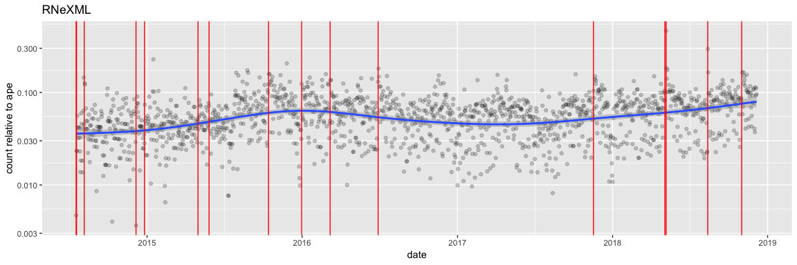

    #> `geom_smooth()` using method = 'gam' and formula 'y ~ s(x, bs = "cs")'

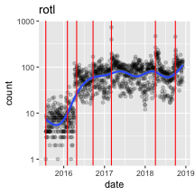

    #> `geom_smooth()` using method = 'gam' and formula 'y ~ s(x, bs = "cs")'

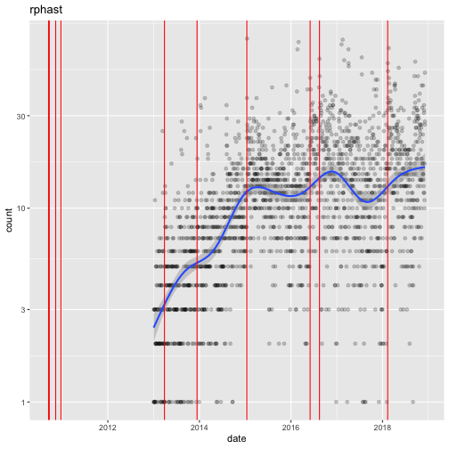

    #> `geom_smooth()` using method = 'gam' and formula 'y ~ s(x, bs = "cs")'

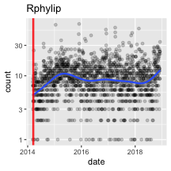

    #> `geom_smooth()` using method = 'gam' and formula 'y ~ s(x, bs = "cs")'

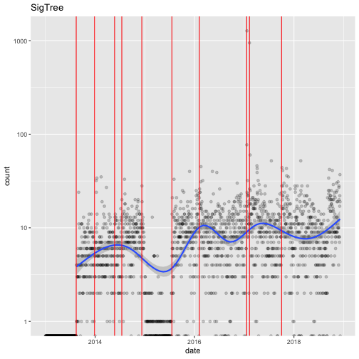

    #> `geom_smooth()` using method = 'gam' and formula 'y ~ s(x, bs = "cs")'

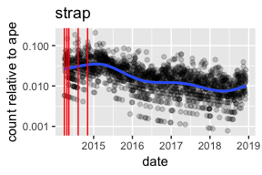

    #> `geom_smooth()` using method = 'gam' and formula 'y ~ s(x, bs = "cs")'

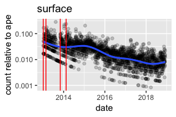

    #> `geom_smooth()` using method = 'gam' and formula 'y ~ s(x, bs = "cs")'

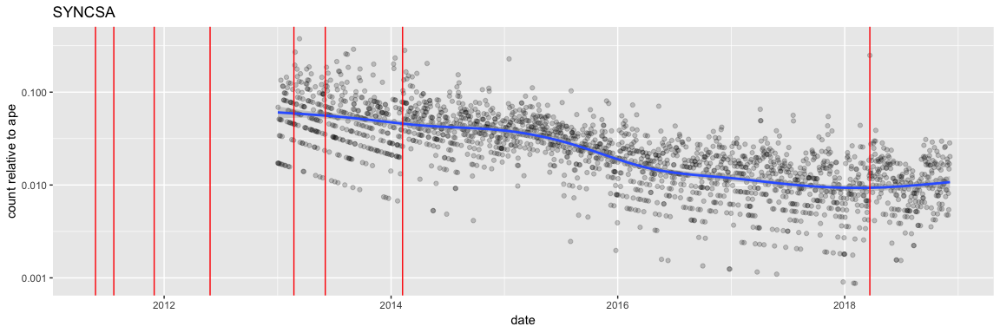

    #> `geom_smooth()` using method = 'gam' and formula 'y ~ s(x, bs = "cs")'

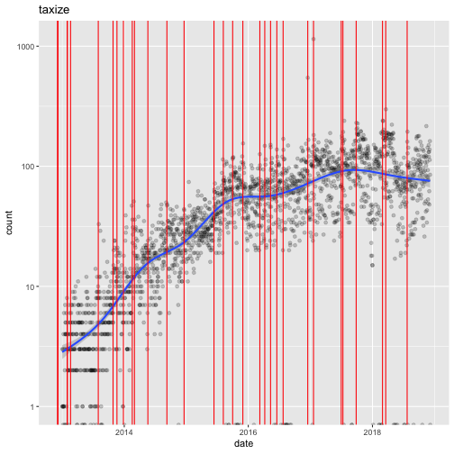

    #> `geom_smooth()` using method = 'gam' and formula 'y ~ s(x, bs = "cs")'

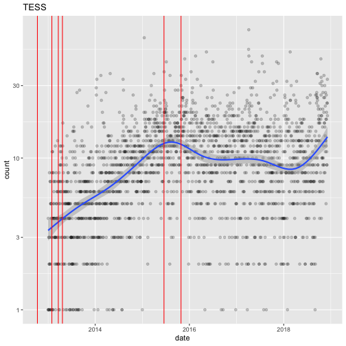

    #> `geom_smooth()` using method = 'loess' and formula 'y ~ x'

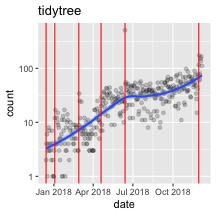

    #> `geom_smooth()` using method = 'gam' and formula 'y ~ s(x, bs = "cs")'

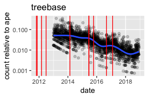

    #> `geom_smooth()` using method = 'loess' and formula 'y ~ x'

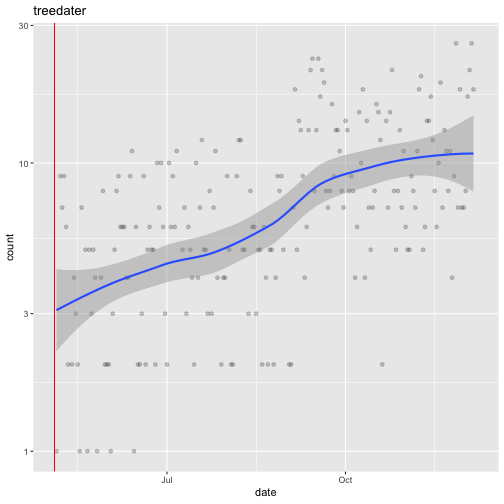

    #> `geom_smooth()` using method = 'gam' and formula 'y ~ s(x, bs = "cs")'

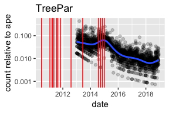

    #> `geom_smooth()` using method = 'loess' and formula 'y ~ x'

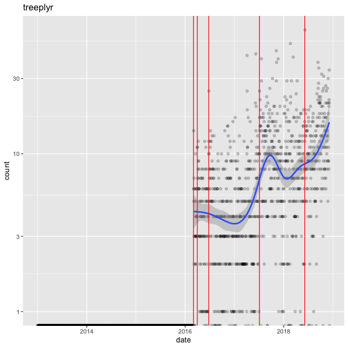

    #> `geom_smooth()` using method = 'gam' and formula 'y ~ s(x, bs = "cs")'

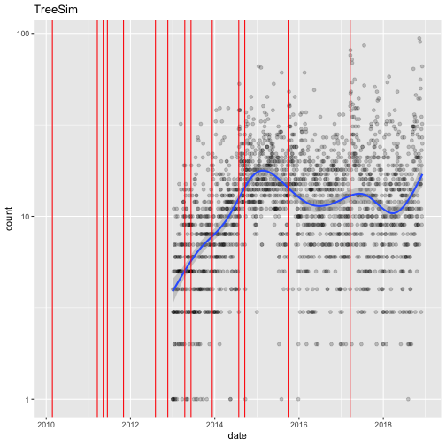

    #> `geom_smooth()` using method = 'gam' and formula 'y ~ s(x, bs = "cs")'

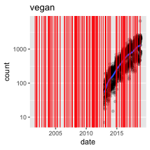

    #> `geom_smooth()` using method = 'gam' and formula 'y ~ s(x, bs = "cs")'

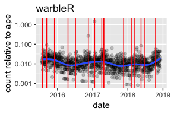

    #> `geom_smooth()` using method = 'gam' and formula 'y ~ s(x, bs = "cs")'

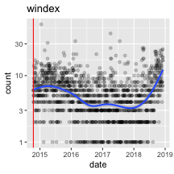
